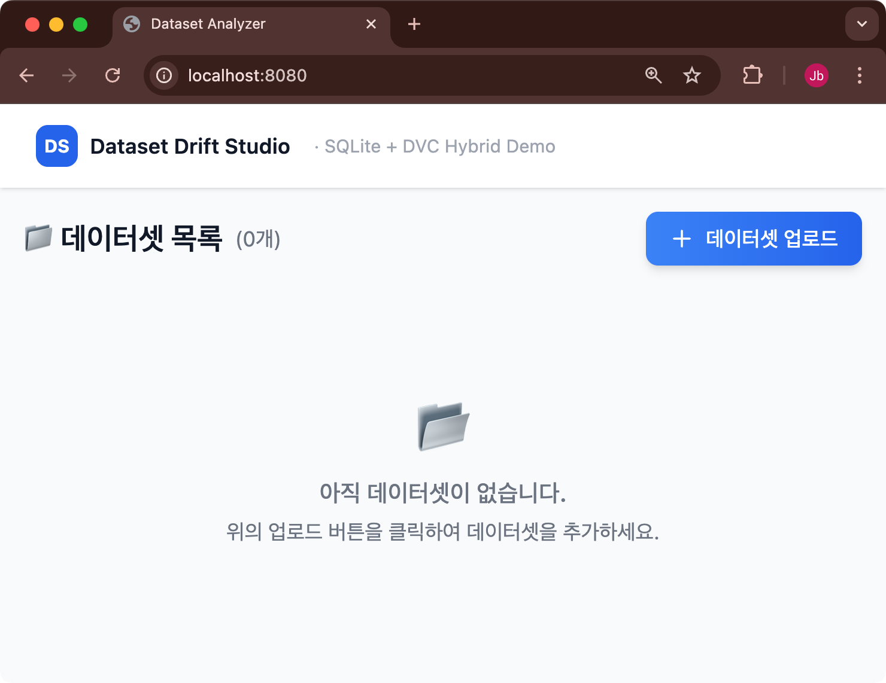
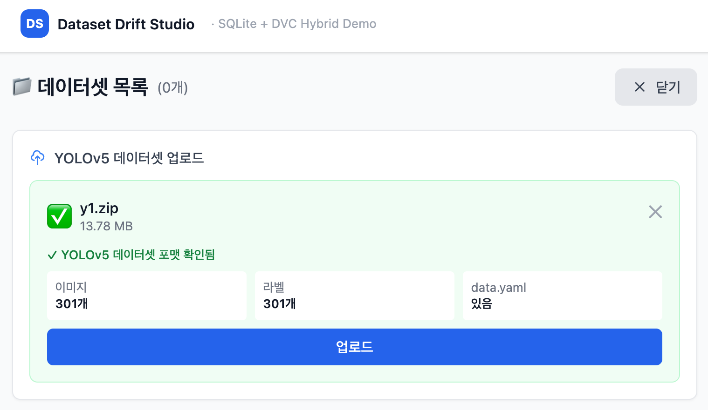
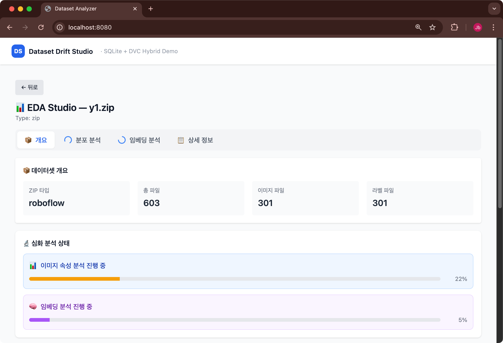
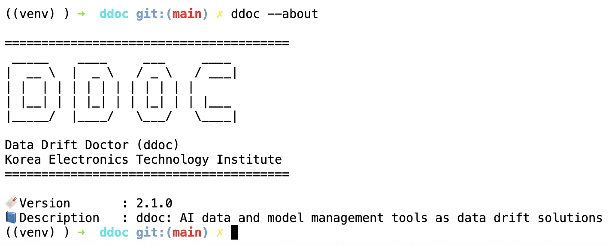

# datadrift_base_framework


## 주소
- https://github.com/keti-datadrift/datadrift_base_framework.git

## 개요
- 데이터 드리프트 관리 기술의 기반 프레임워크입니다.
- 드리프트 스튜디오 컨테이너와 ddoc core cli를 포함합니다.
- 코어 엔진은 플러그인 구조로 확장성을 높입니다.
- docker 컨테이너 기반으로 서비스 모듈을 구성하여 쉬운 프로비저닝을 지원합니다.
- 개발 및 유지 관리 기관 : __한국전자기술연구원(KETI)__
- 최종 검토 기관 : 한국전자기술연구원(KETI)

## 1. 드리프트 스튜디오 실행방법

- 소스코드를 호스트 컴퓨터에 다운로드 합니다.
```bash
git clone https://github.com/keti-datadrift/datadrift_base_framework.git
cd drift_studio
bash up.sh
```

### 빠른 사용 (Quick start)

#### 단일 데이터셋 EDA(탐색적 데이터 분석)
- 서비스가 실행되면 localhost:8080에 접속합니다.


- 데이터셋 업로드를 수행합니다. (e.g. 샘플데이터 drift_studio/sample_dataset)


- 업로드된 데이터셋 카드 목록을 확인합니다.


- "EDA(Exploratory Data Analysis)" 버튼을 클릭후, "분석 시작" 버튼을 클릭합니다.


- EDA 분석페이지로 진입하여 데이터셋의 기본 특징 (e.g. 파일수, 타입, 폴더 구조 등)을 확인합니다.
- 심층분석이 필요하면 "분석 시작" 버튼을 클릭합니다.


- "분석 시작" 버튼을 클릭하면, 데이터셋 각각을 심층분석하거나 embedding 처리를 수행합니다.
- 분석결과는 내부 캐시에 저장되어 재차 EDA 수행시에 빠른 처리가 보장됩니다.


#### 데이터셋 상호간 드리프트 분석

- 비교할 여러 데이터셋들을 업로드하여 분석합니다.


- 여러 데이터셋들 간에 비교를 위해 "Drift (드리프트 분석)" 버튼을 클릭합니다.


- "Drift (드리프트 분석)" 분석 페이지에서 데이터셋 상호간 차이를 분석합니다.


## 2. ddoc 커맨드라인 앱엔진 설치 및 실행방법

- drift_studio/ddoc에 위치
- 파이썬 가상환경 생성

```bash
python3 -m venv venv
```

- 파이썬 가상환경 진입
```bash
source venv/bin/activate
```

- ddoc 설치 폴더 이동

```bash
cd drift_studio/ddoc
```


- ddoc 설치
```bash
bash 03_install_ddoc.sh
```

- ddoc 설치 설치 결과


[ddoc README.md](./drift_studio/ddoc/docs/README.md)

## Acknowledgements (사사)
- 이 연구는 2024년도 정부(과학기술정보통신부)의 재원으로 정보통신기획평가원의 지원을 받아 수행된 연구임 (No. RS-2024-00337489, 분석 모델의 성능저하 극복을 위한 데이터 드리프트 관리 기술 개발)
- This work was supported by Institute of Information & communications Technology Planning & Evaluation (IITP) grant funded by the Korea government(MSIT) (No. RS-2024-00337489, Development of data drift management technology to overcome performance degradation of AI analysis models)


