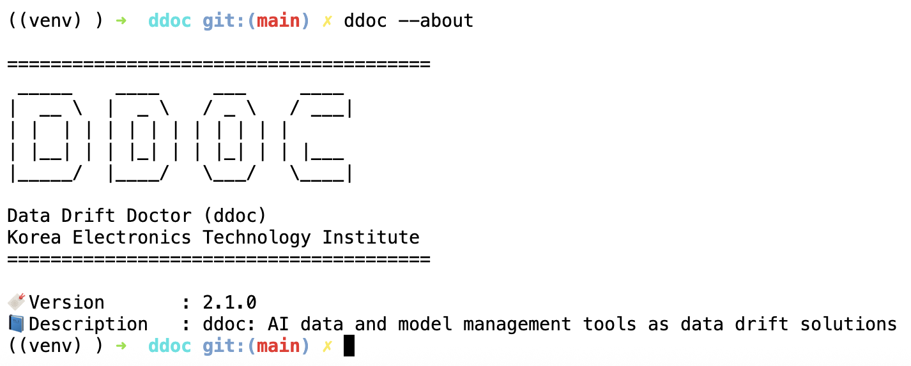
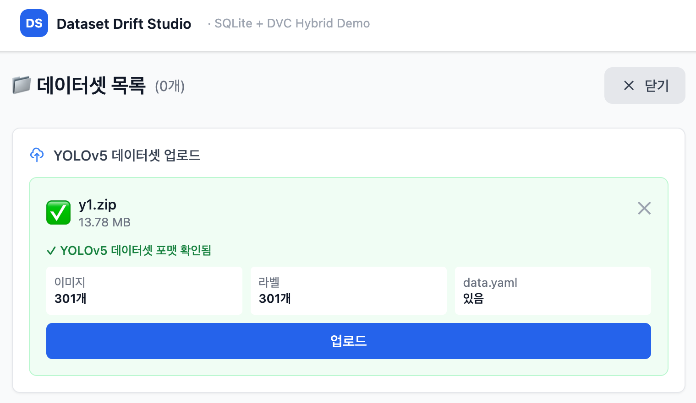
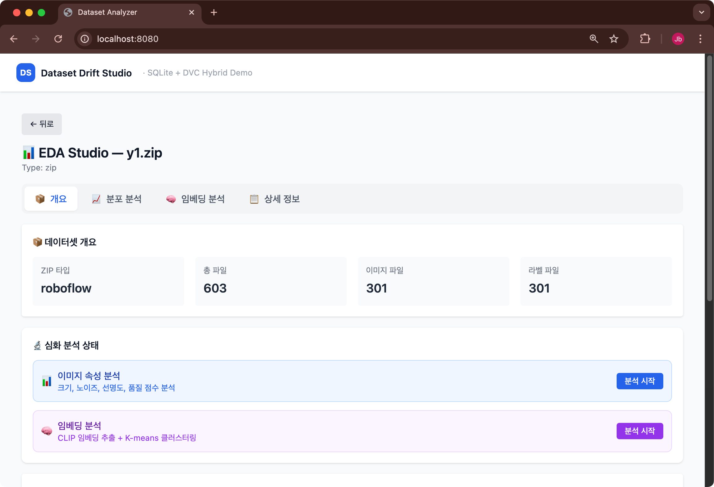
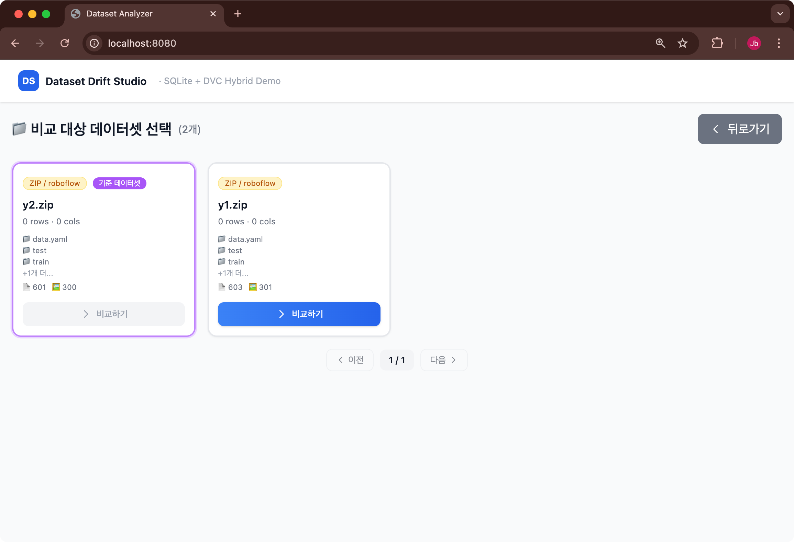
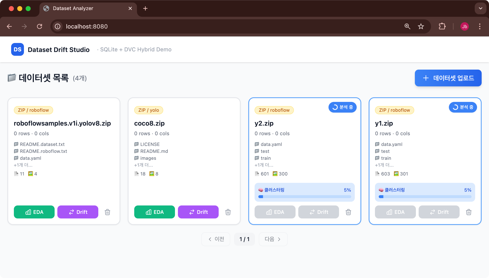

# datadrift_base_framework

**Drift Studio / ddoc** — a plugin-based framework for detecting, diagnosing,
and acting on data drift in ML systems.



## What is in this repository

```
drift_studio/
├── ddoc/          # Core: the `ddoc` CLI / REST / GUI (pluggy hookspecs + YAML recipe DSL)
│   └── plugins/   # In-tree plugins (vision, text, timeseries, audio, categorical, ...)
├── backend/       # Drift Studio server (FastAPI) — orchestrates ddoc runs, model registry,
│                  # training dispatch, promotion gates
├── frontend/      # Drift Studio web UI (React 18 + Vite + Tailwind)
└── sample_dataset/
```

Three ways to use it:

| Surface | Entry point | Use case |
|---|---|---|
| **CLI** | `ddoc <command>` | scripting, CI, remote/batch execution |
| **REST** | `ddoc serve` or the Drift Studio backend | integrate with your own services |
| **GUI** | Drift Studio frontend / `ddoc serve` static UI | interactive exploration |

## Core ideas

- **The framework is light; plugins carry the weight.** `ddoc` core defines
  [pluggy hookspecs](drift_studio/ddoc/ddoc/plugins/hookspecs.py)
  (`eda_run`, `drift_detect`, `retrain_run`, `report_render`, ...).
  Adding a new detector or trainer means writing a plugin — zero framework changes.
- **Recipes.** A YAML DSL (`ddoc recipe run <file>`) chains fetch → analyze →
  report → export steps with variable substitution, so an entire drift-check
  pipeline is a reviewable text file.
- **Loose coupling to applications.** Monitored applications exchange
  JSON "feedback envelopes" with ddoc over files or HTTP — no shared Python
  dependency in either direction.

## Quick start

```bash
cd drift_studio/ddoc
pip install -e .                       # core CLI
pip install -e plugins/ddoc-plugin-vision   # add a domain plugin

ddoc init
ddoc plugin list
ddoc analyze drift --help
```

Run the full Drift Studio stack (backend + frontend + workers):

```bash
cd drift_studio
docker-compose up -d
```

## In-tree plugins

`vision` (image EDA/drift/XAI) · `text` · `timeseries` · `audio` ·
`categorical` (JS-divergence on count dicts) · `keti-temporal`
(temporal categorical drift patterns) · `reference-engine`
(baseline-selection maturity ladder + event ontology) · `evidently`
(third-party integration) · `yolo` (retraining) · `tabular` · `nlp` ·
`vis` (Streamlit GUI)

Each plugin is an independent pip package registered through the
`ddoc` entry-point group.

## Screenshots

| | |
|---|---|
|  |  |
|  |  |

## License

Apache License 2.0 — see [LICENSE](LICENSE).
Vendored third-party code retains its original license
(e.g. OpenAI CLIP under MIT, see
`drift_studio/ddoc/plugins/ddoc-plugin-vision/ddoc_plugin_vision/clip/LICENSE`).
